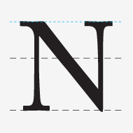
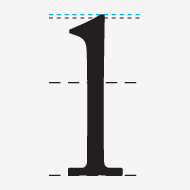
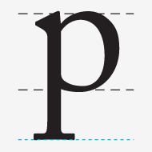

# 你不知道的 `line-height`

在开始介绍 `line-height` 之前，我们先系统的介绍下 font 中的一些基本概念。

### base-line

> In typography, the baseline is the imaginary line upon which a line of text rests. In most typefaces, the descenders on characters such as g or p extend down below the baseline while curved letters such as c or o extend ever-so-slightly below the baseline. The baseline is the point from which other elements of type are measured including x-height and leading. The baseline is also significant in the alignment of drop caps and other page elements.

### mean-line

> Imaginary line running along the top of non-ascending, lowercase letters.

> In typography, the mean line, also (and more simply) known as midline, is the line that determines where non-ascending lowercase letters terminate in a typeface. The distance between the baseline and the mean line is called the x-height.

### Cap-line

> A line marking the height of uppercase letters within a font.

### Ascender

> In typography, the upward vertical stem on some lowercase letters, such as h and b, that extends above the x-height is the ascender. The height of the ascenders is an identifying characteristic of many typefaces.

### Ascender-line

> The invisible line marking the height of ascenders in a font.

### Ascent-line

> The invisible line marking the farthest distance between the baseline and the top of the glyph.

### Descender

> The portion of some lowercase letters, such as g and y, that extends or descends below the baseline is the descender. The length and shape of the descender can affect readability of lines of type and is an identifying factor for some typefaces.

### Descender-line

> The invisible line marking the lowest point of the descenders within a font.

### Descent-line

> The invisible line marking the farthest distance between the baseline and the bottom of the glyph.

### x-height

> In typography, x-height is the distance between the baseline of a line of type and tops of the main body of lower case letters (i.e. excluding ascenders or descenders). The x-height is a factor in typeface identification and readability.

### Cap-height

> The height of a capital letter measured from the baseline.

### Body-height

> The complete area covered by all of the characters in a font. In typography, the body height refers to the distance between the top of the tallest letterform to the bottom of the lowest one.

# line-height

在理解了上述的概念后，我们正式开始介绍 line-height.

在 CSS 中并不会有如上那么细致的介绍

XpxhÉĘ

# 参考文章

* <http://www.typographydeconstructed.com/>

* <https://www.w3.org/TR/CSS22/visudet.html#line-height>

* <http://stackoverflow.com/questions/27631736/meaning-of-top-ascent-baseline-descent-bottom-and-leading-in-androids-font>